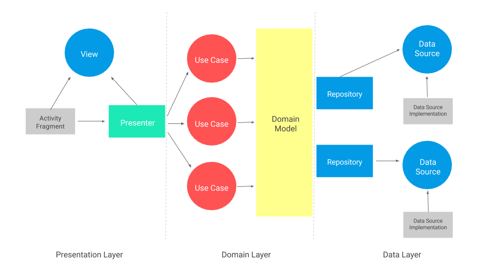

KotlinTestApp
=============

Solution to display information about some of the most remarkable characters of the Starwars saga.
 

Clean architecture Modules
--------------------------
* Presentation: MVP.
* Domain
* Data

Features
--------------------------
1. [Done] Get a list of the characters from http://swapi.co/api/people API.
2. [Done] Show a list of characters sorted by default on name.
3. [Done] Add one button that allows the user to change the sort method between:
    * [Done] Character name.
    * [Done] Character birth year.
4. [Done] Add one button to each cell to mark characters as favourite.
5. [ToDo] If you press the cell you have to show another view with the character detailed   information:
    * Films.
    * Vehicles.
    * Homeworld.

Extra features
--------------------------
6. [Done] Your GUI interface should contain a text box to search characters by name or homeworld. Once the user stop typing, your list will be updated with users that matches with the search term.
7. [Done] Create another view, similar to the first one, to show users marked as favourite or add it as another filter in the main view.
8. [ToDo] Make it available offline! Use any of the existing solutions (SharedPreferences, Realm, SQLite, etc..) to do persistent storage and available to the user when there is no internet connection.
9. [Done] Use of some kind of version control, preferably Github. ! Be structured and clean!
10. Be creative!

11. [ToDO] Tests. Data, Domain and Presentation 

Screenshots
--------------------------

